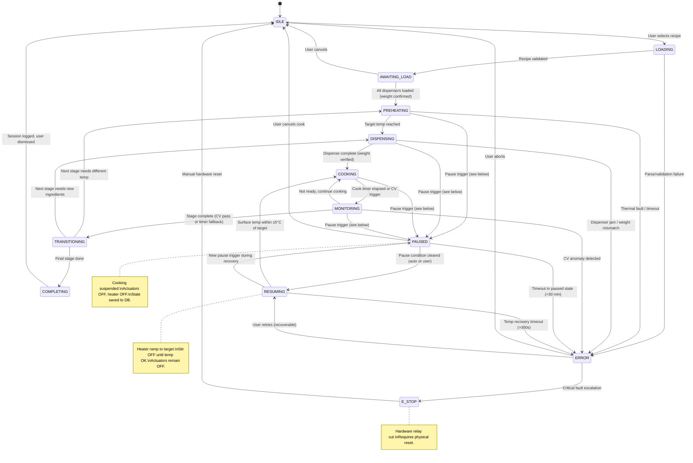
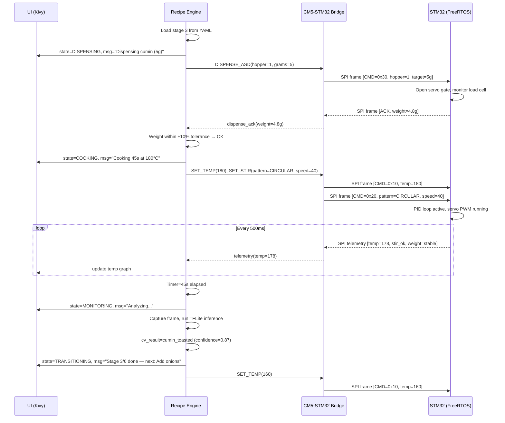

# Main Loop State Machine

This document describes the main cooking loop state machine and how each state drives behavior across the three system layers: **UI** (Kivy touchscreen), **Controller** (Recipe Engine on CM5), and **Driver** (STM32 FreeRTOS).

> [!note] Related
> See [[02-Controller-Software-Architecture|Controller Software Architecture]] for the overall dual-processor design, recipe YAML format, and CV pipeline details.

---

## State Diagram



---

## State-Layer Impact Table

| State | UI (Kivy) | Controller (CM5 Recipe Engine) | Driver (STM32) |
|-------|-----------|-------------------------------|----------------|
| **IDLE** | Recipe browser, cook history, settings | Waiting for recipe selection | Sensors polling at 1 Hz, heartbeat to CM5, safety idle checks |
| **LOADING** | "Validating recipe..." spinner | Parse YAML, resolve ingredient list, check dispenser mapping | No change from IDLE |
| **AWAITING_LOAD** | Checklist UI: "Load onions in CID-1 ✓", live weight readout per slot | Monitor load cell readings via bridge service, compare against recipe requirements | Report load cell weights on poll request |
| **PREHEATING** | Progress bar (current temp → target), ETA countdown | Send `SET_TEMP(target, ramp_rate)` via bridge, poll telemetry at 2 Hz | PID ramp-up, CAN `SET_POWER` command to induction surface, report temp |
| **DISPENSING** | "Dispensing oil (30 g)..." with live weight bar | Send `DISPENSE_SLD(channel, target_g)` or `DISPENSE_CID(tray)`, verify ACK, monitor weight convergence | Actuate pumps/servos/actuators, stream load cell delta, report completion ACK |
| **COOKING** | Timer countdown, live temp graph, stir pattern indicator | Send `SET_STIR(pattern, speed)`, maintain temp setpoint, trigger CV capture at 2 Hz | PID hold temperature, PWM servo pattern execution, report telemetry |
| **MONITORING** | CV confidence overlay on camera feed, "Analyzing..." indicator | Run TFLite inference on latest frame, evaluate `cv_check` condition, apply timer fallback | Continue current PID + stir setpoints unchanged |
| **TRANSITIONING** | "Stage 3/6 complete — next: Add Dal", brief animation | Compute next stage parameters from YAML, send new `SET_TEMP` / `DISPENSE` commands | Ramp temp to new target, stop or change stir pattern |
| **COMPLETING** | "Cooking Complete!" summary card, rating prompt, share option | Log session to PostgreSQL, publish MQTT `cook/complete`, compute nutrition estimate | Heater OFF (CAN `SET_POWER(0)`), stir OFF, exhaust fan cooldown ramp |
| **PAUSED** | Pause overlay showing reason (power loss / sensor fault / induction error / user), elapsed pause timer, cancel button; resume button enabled only when condition cleared | Suspend stage timer, save cooking state snapshot to PostgreSQL (stage index, elapsed time, setpoints, pause reason), hold setpoints in memory, log pause event with telemetry | Heater OFF (CAN `SET_POWER(0)`), all actuators OFF (MOSFET gates LOW, PCF8574 outputs LOW), stir OFF, exhaust fan continues at idle (25%), sensors continue polling at 1 Hz |
| **RESUMING** | "Resuming — Heating to {target}°C" with live temp progress bar, stir/dispense paused indicator | Send `SET_TEMP(saved_target, ramp_rate)` via bridge, poll telemetry at 2 Hz, wait for IR temp within ±5°C of target for 3 consecutive readings, then transition to COOKING with restored stage timer | PID ramp-up to saved target, CAN `SET_POWER` active, stir OFF (resumes on COOKING entry), actuators OFF, report telemetry |
| **ERROR** | Error description banner, retry / skip stage / abort buttons | Classify error (recoverable vs critical), determine recovery options, log to DB | Depends on error: reduce power, stop dispensing, or hold safe state |
| **E_STOP** | Full-screen red alert: "Emergency Stop — Reset Required" | Log event with full telemetry snapshot, await manual reset GPIO signal | Cut heater relay (hardware), brake servo, activate buzzer, all outputs safe |

---

## Sequence Diagram: Single Cooking Stage

The following shows message flow for a typical "Add Spices" stage from the Dal Tadka recipe (stage 3: add cumin seeds to hot oil).



---

## Transition Trigger Table

| From | To | Trigger | Details |
|------|----|---------|---------|
| IDLE | LOADING | User action | User taps recipe and confirms "Start Cook" |
| LOADING | AWAITING_LOAD | Validation pass | YAML parsed, all ingredients mapped to dispensers |
| LOADING | ERROR | Validation fail | Missing ingredient, unsupported dispenser, corrupt YAML |
| AWAITING_LOAD | PREHEATING | Weight confirmed | All required dispenser slots report weight ≥ recipe minimum |
| AWAITING_LOAD | IDLE | User cancel | User taps "Cancel" before loading |
| PREHEATING | DISPENSING | Temp threshold | IR sensor reads within ±5°C of stage target for 3 consecutive readings |
| PREHEATING | ERROR | Timeout / fault | Temp not reached within `preheat_timeout` (default 300 s) or CAN coil over-temp |
| DISPENSING | COOKING | Weight converged | Load cell delta matches target ±10%, or fixed dispense time elapsed |
| DISPENSING | ERROR | Jam / mismatch | No weight change after actuation, or weight exceeds 150% of target |
| COOKING | MONITORING | Timer / CV | `duration_seconds` elapsed, or periodic CV check interval reached |
| COOKING | PAUSED | Pause trigger | See [[#Pause Triggers]] below |
| PREHEATING | PAUSED | Pause trigger | See [[#Pause Triggers]] below |
| DISPENSING | PAUSED | Pause trigger | See [[#Pause Triggers]] below |
| MONITORING | PAUSED | Pause trigger | See [[#Pause Triggers]] below |
| MONITORING | TRANSITIONING | Stage complete | `cv_check` condition met (confidence ≥ threshold) or timer fallback expired |
| MONITORING | COOKING | Not ready | CV confidence below threshold, resume cooking with same setpoints |
| MONITORING | ERROR | CV anomaly | Anomaly detected (e.g., smoke, empty vessel, unexpected color) |
| TRANSITIONING | PREHEATING | Temp change needed | Next stage `temp_target` differs by >10°C from current |
| TRANSITIONING | DISPENSING | New ingredients | Next stage has `ingredients` list to dispense |
| TRANSITIONING | COMPLETING | Last stage | No more stages in recipe YAML |
| COMPLETING | IDLE | Session end | Log written, user dismisses summary or 5 min auto-return |
| PAUSED | RESUMING | Condition cleared | Pause condition resolved: AC power restored (POWER_FAIL state=OK + 2s debounce), sensor/actuator fault cleared (healthy telemetry for 3 consecutive readings), induction error cleared (CAN status OK), or user taps "Resume" (manual pause only). Auto-resume if pause duration <5 min; user prompt if >5 min |
| PAUSED | IDLE | User cancel | User taps "Cancel Cook" during pause |
| PAUSED | ERROR | Pause timeout | Paused longer than 30 min without action |
| RESUMING | COOKING | Temp recovered | IR sensor reads within ±5°C of saved stage target for 3 consecutive readings (same criteria as PREHEATING → DISPENSING). Stage timer resumes from saved elapsed value. Stir pattern restored on entry to COOKING |
| RESUMING | PAUSED | New pause trigger | A new pause condition occurs during temperature recovery (e.g., power fails again during ramp-up) |
| RESUMING | ERROR | Recovery timeout | Surface temp does not reach target within 300s (5 min) of ramp start — indicates possible heater or sensor fault |
| ERROR | IDLE | User abort | User taps "Abort" — session logged as incomplete |
| ERROR | RESUMING | User retry | Recoverable error — user taps "Retry", controller enters RESUMING to re-establish temperature before resuming cook |
| ERROR | E_STOP | Critical fault | Thermal runaway, CAN bus failure, or repeated unrecoverable error |
| E_STOP | IDLE | Hardware reset | Physical reset button pressed, watchdog confirms safe state |

---

## Pause Triggers

Any active cooking state (PREHEATING, DISPENSING, COOKING, MONITORING) can transition to PAUSED when one of the following conditions is detected. The pause reason is stored in the cooking state snapshot to determine the appropriate resume behavior.

| Trigger | Source | Detection | Auto-Resume? | Details |
|---------|--------|-----------|-------------|---------|
| **AC Power Failure** | STM32 COMP2 (PA1) | `POWER_FAIL(state=1)` SPI message or PWR_FAIL GPIO on J_STACK pin 16 goes LOW | Yes, if <5 min | 24V rail drops below ~16.5V. STM32 immediately disables all actuators. CM5 saves state to PostgreSQL. UPS keeps CM5+STM32 alive. On power restore (`POWER_FAIL(state=0)` after 2s debounce), auto-resume if pause <5 min, else prompt user |
| **Sensor Malfunction** | STM32 telemetry | IR temp reads out-of-range (< -10°C or > 400°C), load cell HX711 timeout (no DOUT response), INA219 I2C NAK | No — user prompt | Sensor data unreliable. CM5 identifies which sensor failed from telemetry anomaly. Cooking cannot safely continue without correct readings. User prompted to check sensor connection and tap "Resume" |
| **Actuator Malfunction** | STM32 telemetry / timeout | Servo stall detected (current spike with no position change), DRV8876 nFAULT asserted, peristaltic pump no flow (no weight delta after 5s of actuation), solenoid no pressure change (ADS1015 reading flat after valve open) | No — user prompt | Actuator failed to perform expected action. CM5 logs fault details. User prompted to inspect actuator and tap "Resume" |
| **Induction Cooktop Error** | STM32 CAN bus | CAN error frame received, induction module reports fault code (overcurrent, overtemp, IGBT failure), or CAN bus timeout (no heartbeat for >2s) | Depends on fault | Transient faults (e.g., CAN timeout, momentary overtemp): auto-retry once after 5s, then pause. Permanent faults (IGBT failure): pause and prompt user. CAN bus offline: pause immediately |
| **User Pause** | UI touch event | User taps "Pause" button on cooking screen | No — user must tap "Resume" | Manual pause for lid check, ingredient addition, etc. |

### Pause State Persistence

On entering PAUSED, the Recipe Engine saves a snapshot to PostgreSQL:

```json
{
  "session_id": "uuid",
  "pause_reason": "POWER_FAILURE | SENSOR_FAULT | ACTUATOR_FAULT | INDUCTION_ERROR | USER_PAUSE",
  "paused_at": "2026-02-20T14:30:00Z",
  "stage_index": 3,
  "stage_elapsed_s": 28.5,
  "temp_target_c": 180,
  "temp_actual_c": 176,
  "stir_pattern": "CIRCULAR",
  "stir_speed_rpm": 40,
  "fault_details": "CAN timeout on induction module (no heartbeat for 2.1s)"
}
```

This snapshot enables RESUMING to restore exact cooking parameters. If the CM5 reboots during a long power outage (UPS depleted), the saved state is recovered from PostgreSQL on next boot.

### Resume Decision Logic

```
On pause condition cleared:
  if pause_reason == USER_PAUSE:
      wait for user to tap "Resume"
  else if pause_duration < 5 minutes:
      auto-transition to RESUMING
  else if pause_duration < 30 minutes:
      prompt user: "Power restored. Resume cooking?" [Resume] [Cancel]
  else:
      transition to ERROR (food safety — too long at unsafe temperature)
```

> [!warning]
> The 30-minute pause timeout is a food safety limit. If food has been sitting at unsafe temperatures (between 5°C and 60°C) for more than 30 minutes, the system transitions to ERROR and the cook session is marked as failed. This aligns with general food safety guidelines for the temperature danger zone.

---

## Related Documentation

- [[02-Controller-Software-Architecture|Controller Software Architecture]] — Recipe YAML format, CV pipeline, PID tuning
- [[08-Tech-Stack|Tech Stack]] — Yocto, Kivy, FreeRTOS, Docker stack
- [[../../04-UserInterface/03-UI-UX-Design|UI/UX Design]] — Touchscreen wireframes and screen flows
- [[../../05-Subsystems/09-Induction-Heating|Induction Heating]] — PID control and CAN bus protocol
- [[../../05-Subsystems/03-Ingredient-Dispensing|Ingredient Dispensing]] — ASD/CID/SLD subsystem details

---

## Revision History

| Version | Date | Author | Changes |
|---------|------|--------|---------|
| 1.0 | 2026-02-15 | Manas Pradhan | Initial document creation |
| 2.0 | 2026-02-20 | Manas Pradhan | Expanded PAUSED state with multi-cause triggers (power failure, sensor/actuator malfunction, induction error); added RESUMING state for temperature recovery before returning to COOKING; PAUSED now reachable from PREHEATING, DISPENSING, MONITORING (not just COOKING); added pause triggers table, state persistence schema, and resume decision logic; ERROR → RESUMING replaces ERROR → COOKING |
