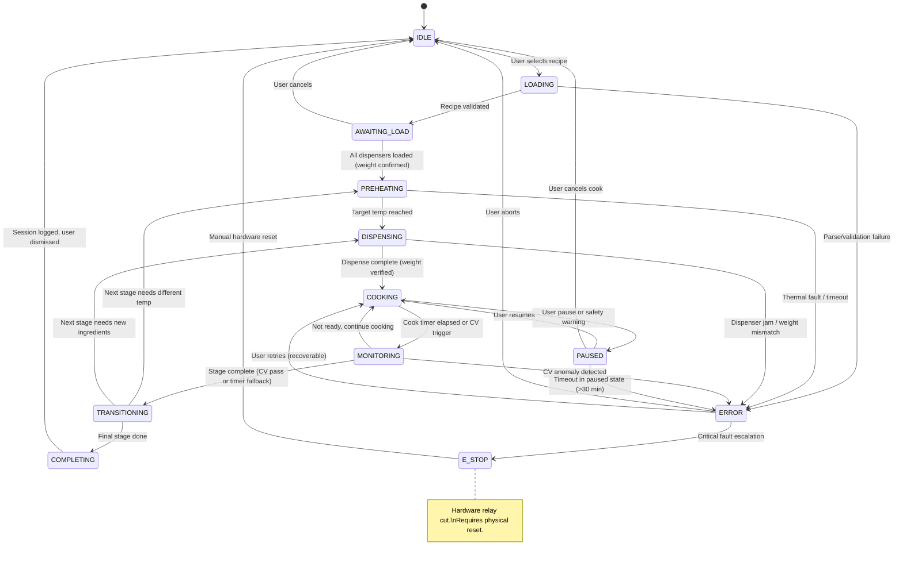
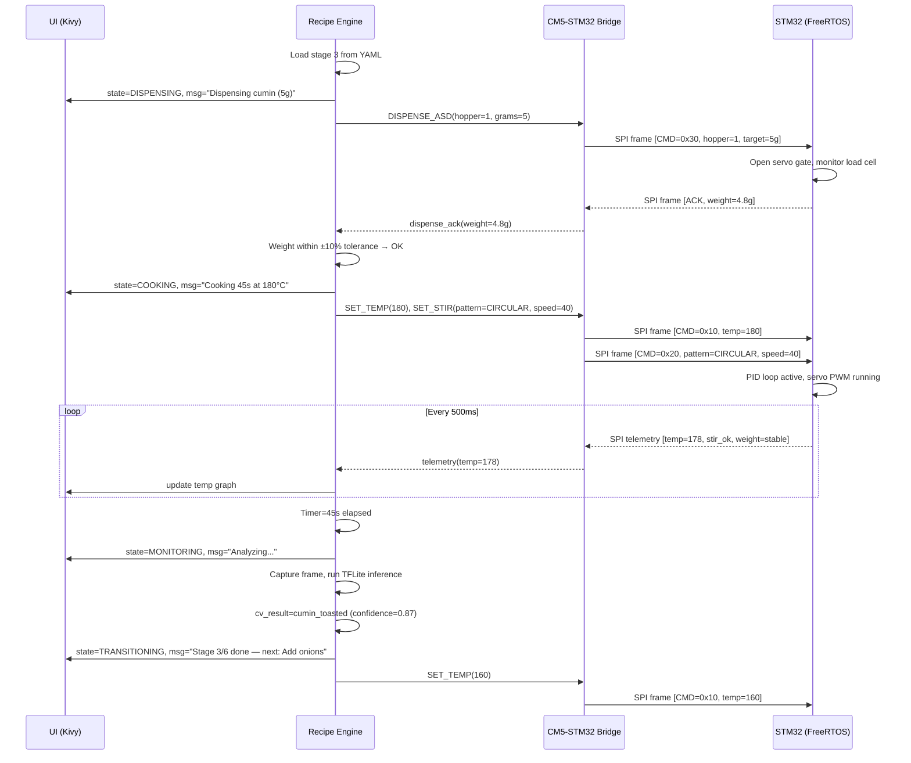

# Main Loop State Machine

This document describes the main cooking loop state machine and how each state drives behavior across the three system layers: **UI** (Kivy touchscreen), **Controller** (Recipe Engine on CM5), and **Driver** (STM32 FreeRTOS).

> [!note] Related
> See [[02-Controller-Software-Architecture|Controller Software Architecture]] for the overall dual-processor design, recipe YAML format, and CV pipeline details.

---

## State Diagram

---

## State-Layer Impact Table

| State | UI (Kivy) | Controller (CM5 Recipe Engine) | Driver (STM32) |
|-------|-----------|-------------------------------|----------------|
| **IDLE** | Recipe browser, cook history, settings | Waiting for recipe selection | Sensors polling at 1 Hz, heartbeat to CM5, safety idle checks |
| **LOADING** | "Validating recipe..." spinner | Parse YAML, resolve ingredient list, check dispenser mapping | No change from IDLE |
| **AWAITING_LOAD** | Checklist UI: "Load onions in CID-1 ✓", live weight readout per slot | Monitor load cell readings via bridge service, compare against recipe requirements | Report load cell weights on poll request |
| **PREHEATING** | Progress bar (current temp → target), ETA countdown | Send `SET_TEMP(target, ramp_rate)` via bridge, poll telemetry at 2 Hz | PID ramp-up, CAN `SET_POWER` command to induction surface, report temp |
| **DISPENSING** | "Dispensing oil (30 g)..." with live weight bar | Send `DISPENSE_SLD(channel, target_g)` or `DISPENSE_CID(tray)`, verify ACK, monitor weight convergence | Actuate pumps/servos/actuators, stream load cell delta, report completion ACK |
| **COOKING** | Timer countdown, live temp graph, stir pattern indicator | Send `SET_STIR(pattern, speed)`, maintain temp setpoint, trigger CV capture at 2 Hz | PID hold temperature, PWM servo pattern execution, report telemetry |
| **MONITORING** | CV confidence overlay on camera feed, "Analyzing..." indicator | Run TFLite inference on latest frame, evaluate `cv_check` condition, apply timer fallback | Continue current PID + stir setpoints unchanged |
| **TRANSITIONING** | "Stage 3/6 complete — next: Add Dal", brief animation | Compute next stage parameters from YAML, send new `SET_TEMP` / `DISPENSE` commands | Ramp temp to new target, stop or change stir pattern |
| **COMPLETING** | "Cooking Complete!" summary card, rating prompt, share option | Log session to PostgreSQL, publish MQTT `cook/complete`, compute nutrition estimate | Heater OFF (CAN `SET_POWER(0)`), stir OFF, exhaust fan cooldown ramp |
| **PAUSED** | "Paused" overlay with resume / cancel buttons, elapsed pause timer | Suspend stage timer, hold current setpoints, log pause event | Hold current temp at reduced power (50%), stir OFF |
| **ERROR** | Error description banner, retry / skip stage / abort buttons | Classify error (recoverable vs critical), determine recovery options, log to DB | Depends on error: reduce power, stop dispensing, or hold safe state |
| **E_STOP** | Full-screen red alert: "Emergency Stop — Reset Required" | Log event with full telemetry snapshot, await manual reset GPIO signal | Cut heater relay (hardware), brake servo, activate buzzer, all outputs safe |

---

## Sequence Diagram: Single Cooking Stage

The following shows message flow for a typical "Add Spices" stage from the Dal Tadka recipe (stage 3: add cumin seeds to hot oil).

---

## Transition Trigger Table

| From | To | Trigger | Details |
|------|----|---------|---------|
| IDLE | LOADING | User action | User taps recipe and confirms "Start Cook" |
| LOADING | AWAITING_LOAD | Validation pass | YAML parsed, all ingredients mapped to dispensers |
| LOADING | ERROR | Validation fail | Missing ingredient, unsupported dispenser, corrupt YAML |
| AWAITING_LOAD | PREHEATING | Weight confirmed | All required dispenser slots report weight ≥ recipe minimum |
| AWAITING_LOAD | IDLE | User cancel | User taps "Cancel" before loading |
| PREHEATING | DISPENSING | Temp threshold | IR sensor reads within ±5°C of stage target for 3 consecutive readings |
| PREHEATING | ERROR | Timeout / fault | Temp not reached within `preheat_timeout` (default 300 s) or NTC over-temp |
| DISPENSING | COOKING | Weight converged | Load cell delta matches target ±10%, or fixed dispense time elapsed |
| DISPENSING | ERROR | Jam / mismatch | No weight change after actuation, or weight exceeds 150% of target |
| COOKING | MONITORING | Timer / CV | `duration_seconds` elapsed, or periodic CV check interval reached |
| COOKING | PAUSED | User / safety | User taps pause, or non-critical safety warning (e.g., lid open) |
| MONITORING | TRANSITIONING | Stage complete | `cv_check` condition met (confidence ≥ threshold) or timer fallback expired |
| MONITORING | COOKING | Not ready | CV confidence below threshold, resume cooking with same setpoints |
| MONITORING | ERROR | CV anomaly | Anomaly detected (e.g., smoke, empty vessel, unexpected color) |
| TRANSITIONING | PREHEATING | Temp change needed | Next stage `temp_target` differs by >10°C from current |
| TRANSITIONING | DISPENSING | New ingredients | Next stage has `ingredients` list to dispense |
| TRANSITIONING | COMPLETING | Last stage | No more stages in recipe YAML |
| COMPLETING | IDLE | Session end | Log written, user dismisses summary or 5 min auto-return |
| PAUSED | COOKING | User resume | User taps "Resume" |
| PAUSED | IDLE | User cancel | User taps "Cancel Cook" during pause |
| PAUSED | ERROR | Pause timeout | Paused longer than 30 min without action |
| ERROR | IDLE | User abort | User taps "Abort" — session logged as incomplete |
| ERROR | COOKING | User retry | Recoverable error — user taps "Retry", controller re-sends last command |
| ERROR | E_STOP | Critical fault | Thermal runaway, CAN bus failure, or repeated unrecoverable error |
| E_STOP | IDLE | Hardware reset | Physical reset button pressed, watchdog confirms safe state |

---

## Related Documentation

- [[02-Controller-Software-Architecture|Controller Software Architecture]] — Recipe YAML format, CV pipeline, PID tuning
- [[08-Tech-Stack|Tech Stack]] — Yocto, Kivy, FreeRTOS, Docker stack
- [[../../04-UserInterface/03-UI-UX-Design|UI/UX Design]] — Touchscreen wireframes and screen flows
- [[../../05-Subsystems/09-Induction-Heating|Induction Heating]] — PID control and CAN bus protocol
- [[../../05-Subsystems/03-Ingredient-Dispensing|Ingredient Dispensing]] — ASD/CID/SLD subsystem details

---

## Revision History

| Version | Date | Author | Changes |
|---------|------|--------|---------|
| 1.0 | 2026-02-15 | Manas Pradhan | Initial document creation |
